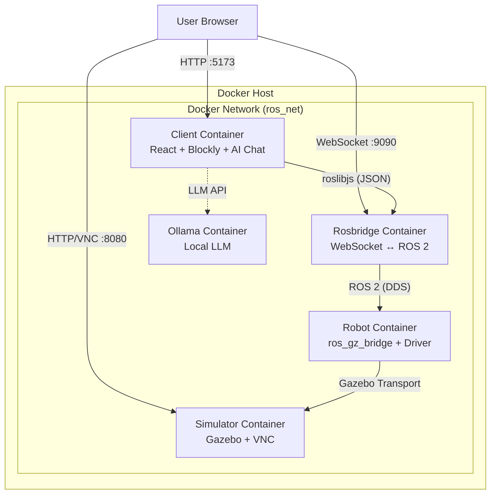

# Project Architecture

This document describes the architecture of the ROS Blockly Robot Control project. The system is designed to allow users to control simulated and physical ROS 2 robots using a visual programming interface (Blockly) running in a web browser.

## High-Level Overview

The project uses Docker Compose to orchestrate multiple services. There are two compose files:
*   `docker-compose.yml` — for **Linux** (rosbridge uses host networking for direct LAN multicast access).
*   `docker-compose.windows.yml` — for **Windows** (adds Zenoh bridge and micro-ROS agent to work around WSL2 multicast blocking).

Services are gated behind **profiles** — only the core services (`rosbridge`, `client`) start by default. Add `--profile sim` for simulation and `--profile ollama` for a local AI model.

See `docs/docker_architecture.md` for full service details and environment variables.

## Services & Networking

### 1. Client (Web Application)
- **Role**: Frontend User Interface.
- **Technology**: React, Vite, Google Blockly, roslibjs, AI chat (Gemini / Ollama).
- **Port**: `${CLIENT_PORT}:5173`.
- **Communication**: Connects to `rosbridge` via WebSocket. URL resolved by 3-tier fallback (localStorage → env var → auto-detect hostname).

### 2. Rosbridge (WebSocket Gateway)
- **Role**: Translates browser JSON ↔ native ROS 2 messages.
- **Technology**: `ros:jazzy-ros-core`, `rosbridge-suite`, CycloneDDS.
- **Networking**:
    - **Linux**: `network_mode: host` (direct LAN multicast, no port mapping).
    - **Windows**: `ros_net` bridge network, port `${ROSBRIDGE_PORT}:9090`.

### 3. Robot (profile: `sim`)
- **Role**: Robot "brain" — runs `ros_gz_bridge` and optionally the UR5 driver node (`action_node.py`).
- **Technology**: `ros:jazzy`, `ros-gz-bridge`.
- **Configuration**: `ROBOT_MODEL` env var selects the bridge config from `docker/robots/<model>/bridge.yaml`.

### 4. Simulator (profile: `sim`)
- **Role**: Runs Gazebo Harmonic with VNC access.
- **Technology**: `osrf/ros:jazzy-desktop-full`, Xvfb, x11vnc, noVNC.
- **Port**: `${VNC_PORT}:8080` for web VNC.
- **Configuration**: `ROBOT_MODEL` env var selects the SDF from `docker/robots/<model>/robot.sdf`.

### 5. Ollama (profile: `ollama`)
- **Role**: Local LLM server for AI chat.
- **Port**: `${OLLAMA_PORT:-11434}:11434`.

### 6. Zenoh Bridge (Windows only)
- **Role**: Tunnels DDS traffic over TCP to bypass WSL2 multicast blocking.
- See `docs/zenoh-network-architecture.md`.

### 7. micro-ROS Agent (Windows only)
- **Role**: UDP agent for ESP32 microcontrollers.
- **Port**: `8888:8888/udp`.

## Network Diagram

*On Linux, `rosbridge` uses host networking and sits outside `ros_net`.*

## Data Flow (Example: Move Robot)

1.  **User Action**: User drags blocks and clicks "Run" in the Header.
2.  **Client**:
    *   Blockly generates JavaScript via package-defined generators.
    *   The execution engine (`useRobotControl`) wraps the code in an async IIFE and runs it with `new Function()`.
    *   `roslibjs` sends a JSON `publish` message to the rosbridge WebSocket for topic `/cmd_vel`.
3.  **Rosbridge**:
    *   Receives JSON.
    *   Deserializes it into a `geometry_msgs/msg/Twist` ROS 2 message.
    *   Publishes it to the `/cmd_vel` topic.
4.  **Robot**:
    *   `ros_gz_bridge` subscribes to `/cmd_vel` (ROS) and translates it to `gz.msgs.Twist` (Gazebo Transport).
5.  **Simulator**:
    *   Gazebo receives the velocity command and applies it to the robot model.
    *   The robot moves in the simulation.
6.  **Feedback**:
    *   Gazebo physics updates the robot pose.
    *   `ros_gz_bridge` publishes pose/odometry back to ROS.
    *   Rosbridge forwards it to the Client over WebSocket (if subscribed).
